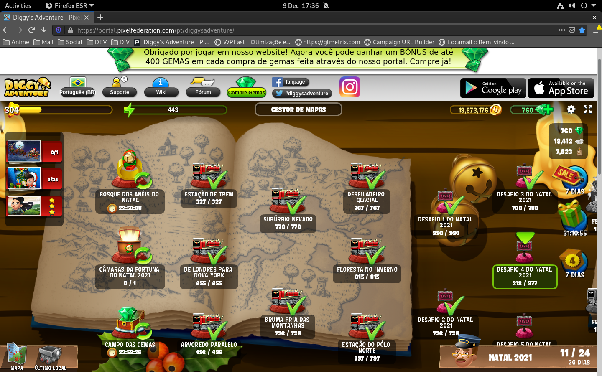
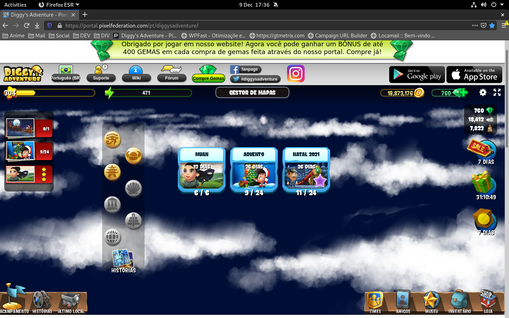
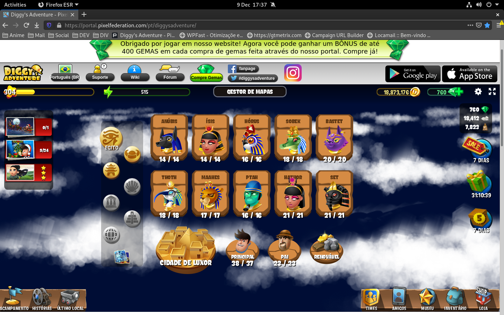
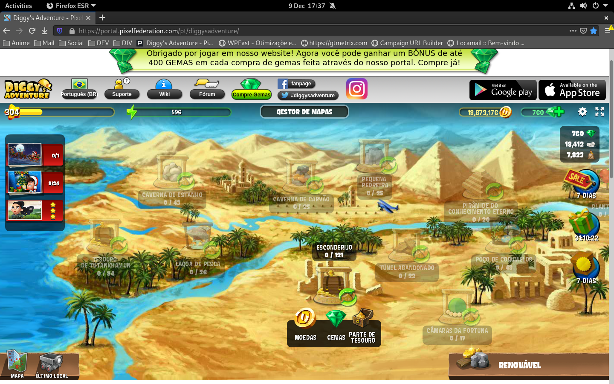
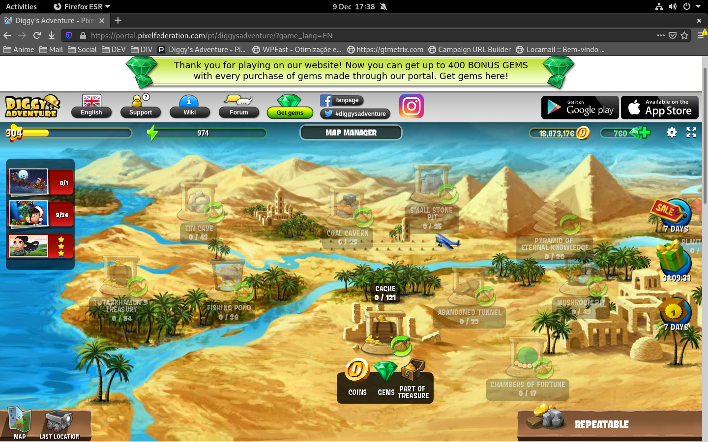
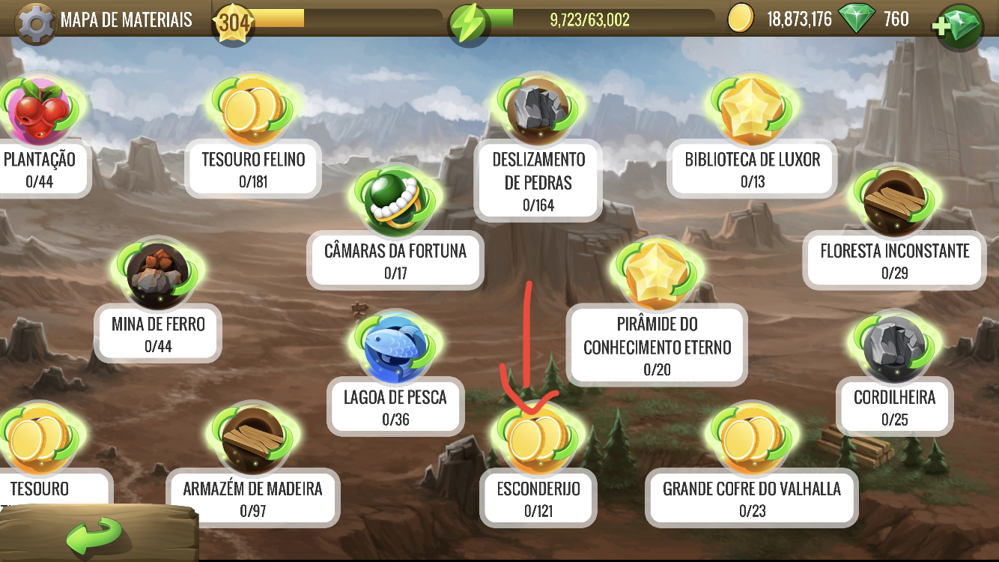
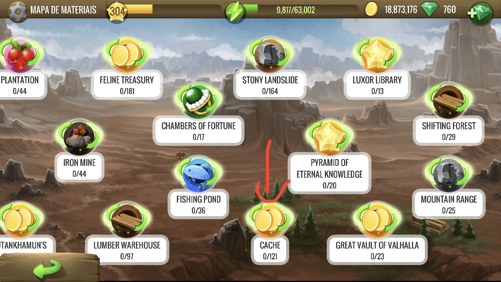

# DA

## 1. Sequência de achar o Local ESCONDERIJO pelo Portal!

### Primeiro passo: Em qualquer lugar, inclusive dentro das missões, clique em MAPA.

### Segundo passo: No menu MAPAS, clique em EGITO.

### Terceiro: No menu EGITO, clique em RENOVÁVEIS.

### Depois de clicar em RENOVÁVEIS aparecerá o Local ESCONDERIJO (Português) / CACHE (Inglês)

## 2. Sequência de achar o Local ESCONDERIJO pelo Celular (Exemplo do iOS)!

### Clicando no Mapa de Materiais o RENOVÁVEIS aparecerá o Local ESCONDERIJO (Português) / CACHE (Inglês) fica desse jeito:

